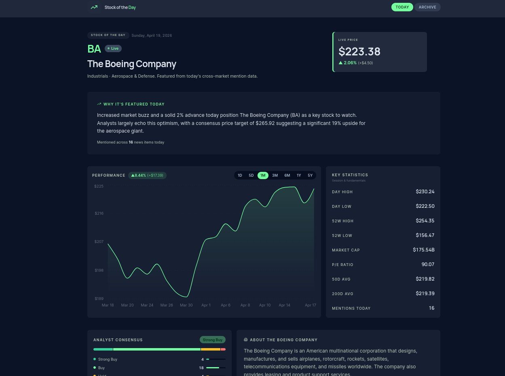

# Stock of the Day

> One stock. Every weekday. Automatically selected, AI-explained, and ready before the market opens.

   

---

## What It Does

Stock of the Day is a fully automated finance app that finds the most talked-about stock each morning and gives you everything you need to understand it — no account, no noise, no manual curation.

Every weekday at 9:30 AM ET, the app scrapes four major financial news outlets and the StockTwits trending feed, scores each ticker by mention volume and social momentum, filters out low-quality picks, and selects one stock to feature for the day.

---

## What You See

**Live price & interactive chart** — OHLCV data across 7 time periods (1D through 5Y), updated in real time from Yahoo Finance.

**AI-generated write-up** — Google Gemini 2.5 Flash explains why the stock is in the spotlight today in 2–3 sharp sentences.

**Analyst ratings** — Wall Street consensus badge, full buy/hold/sell breakdown, and analyst price target.

**Key statistics** — market cap, P/E ratio, 52-week range, and moving averages at a glance.

**Top headlines** — the 3 most relevant articles driving the conversation, scored and ranked by keyword relevance.

**Searchable archive** — every past stock of the day, searchable by ticker or company name.

---

## How the Selection Works

The stock picker runs a multi-signal pipeline:

1. **Scrapes** 4 RSS feeds (Yahoo Finance, CNBC, MarketWatch, Seeking Alpha) for the day's financial news
2. **Merges** article mention counts with StockTwits trending ranks (top 10 = 15 pts, 11–20 = 10 pts, 21–30 = 5 pts)
3. **Filters** candidates against quality gates: market cap ≥ $300M, price ≥ $5, analyst coverage ≥ 5 analysts
4. **Enforces** a 5-day cooldown so the same stock can't repeat within a trading week
5. **Falls back** gracefully through relaxed thresholds if no strong candidate emerges

---

## Tech Stack

| Layer | Technology |
|-------|-----------|
| Frontend | Next.js 16, React 19, Tailwind CSS 4, Recharts, Framer Motion |
| Backend | Python, FastAPI, APScheduler |
| Market Data | Yahoo Finance (via yfinance) |
| Fundamentals & Ratings | Alpha Vantage API |
| AI Write-ups | Google Gemini 2.5 Flash |
| News Scraping | RSS — Yahoo Finance, CNBC, MarketWatch, Seeking Alpha |
| Trending Signal | StockTwits public API |
| Deployment | Railway (backend) · Vercel (frontend) |
